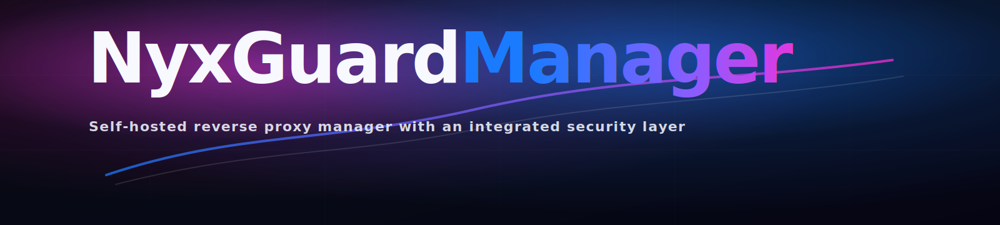

<p align="center">
  
</p>

Operator-grade reverse proxy manager for self-hosted infrastructure. NyxGuard Manager combines proxy hosting (HTTP/TCP/UDP) and certificate automation with an integrated security layer (NyxGuard): WAF-style controls, SQL Shield, bot defence, DDoS protection, auth-bypass hardening, IP/Geo intelligence, attack visibility, and real-time traffic analytics, all running locally on your server with Docker.

## Changelog
<a href="CHANGELOG.md">
  
</a>

## Support
<a href="https://buymeacoffee.com/nyxmael" target="_blank" rel="noopener noreferrer">
  
</a>

## What You Get

### Reverse Proxy Manager
- Proxy Hosts (HTTP), Redirection Hosts, Streams (TCP/UDP), and 404 Hosts
- Per-host SSL controls, access policies, advanced/custom Nginx controls, and custom locations
- Let's Encrypt certificates (HTTP-01 and DNS providers), certificate management, and renew flows
- Access Lists, Users/Roles, and full audit logging
- Setup wizard, dashboard, and system settings panels for day-2 operations

### NyxGuard Security Layer
- Per-proxy toggles: WAF, Bot Defence, DDoS Shield, SQL Shield, Auth Bypass
- Global toggles (GlobalGate): Bot Defence (master), DDoS Shield (master), SQL Shield (master), Auth Bypass (master)
- Web Controls policy engine with versioning, activate/rollback, and effective-policy visibility
- WAF custom rule management with live Nginx apply
- Dashboard + Traffic: live service posture, active hosts, and RX/TX analytics
- Attacks center: centralized stream and counters (SQLi / Bot / DDoS / AuthFail) with response actions
- IPs & Locations: 15m / 1h / 1d / 7d windows, GeoIP attribution, and retention controls
- Rules engine: allow/deny by IP/CIDR or Country (ISO), with optional expiries

### Operations & Integrations
- Event Center to review and clear operational, security, and change activity streams
- Notification channels (Webhook, Slack, Email) with per-event selection and test-send
- Integrations with token-based metrics endpoint for Prometheus/Grafana pipelines
- Built-in Update Manager (check/download/apply workflow, changelog, What's New acknowledgements)
- SSO (OIDC/Auth provider flow) and local-account mapping controls
- LAN Access controls with ARP-assisted host discovery and IP/MAC rule management

### GeoIP Country (Optional)
NyxGuard can show the **country code** for each IP (RO/FR/GB/etc). For accurate results you need a local GeoIP database.

Supported providers:
- **MaxMind GeoLite2 Country** (`.mmdb`) (free)
- **IP2Location Country** (`.mmdb`) (Lite/paid)

Resolution order:
1. Cloudflare header (`CF-IPCountry`) if you are behind Cloudflare
2. MaxMind GeoLite2 (if installed)
3. IP2Location (if installed)

Option A (manual upload, MaxMind GeoLite2):
1. Create a free MaxMind account.
2. Enable GeoLite2 downloads (this creates a License Key).
3. Download **GeoLite2 Country** (`.mmdb`).
4. Upload in the UI: **NyxGuard -> IPs & Locations -> GeoIP DB** (select `MaxMind GeoLite2`) -> **Upload**.

Option B (recommended, auto-update):
1. In **NyxGuard -> IPs & Locations**, enter your MaxMind `AccountID` and `LicenseKey` and save.
2. NyxGuard will keep the GeoLite2 database updated automatically.

Option C (manual upload, IP2Location):
1. Download an IP2Location **Country** database in `.mmdb` format (Lite or paid).
2. Upload in the UI: **NyxGuard -> IPs & Locations -> GeoIP DB** (select `IP2Location (.mmdb)`) -> **Upload**.

## Install (Production)

NyxGuard Manager is published as a prebuilt Docker image on Docker Hub (`nyxmael/nyxguardmanager`).

### Install Via curl (Recommended)

On a fresh Ubuntu/Debian VM (or container), do a quick OS update first and ensure `curl` is installed:

```bash
sudo apt update
sudo apt -y upgrade
sudo apt install -y curl
```

Why this method is recommended:
- Installs into a predictable location: `/opt/nyxguardmanager` (override with `INSTALL_DIR=/your/path`)
- Ensures required dependencies are present (Docker + Compose on Ubuntu/Debian)
- Creates `.env` on first install and keeps upgrades in-place (data stays in Docker volumes)
- Keeps future updates consistent: `update.sh` expects the same install directory

Then run the installer:

```bash
curl -fsSL https://raw.githubusercontent.com/NyxCloudRO/NyxGuardManager/main/install.sh | sudo bash
```

By default the installer:
- detects the latest published image tag from Docker Hub
- pulls `nyxmael/nyxguardmanager:<latest>`
- creates the local Docker Compose stack in `/opt/nyxguardmanager`
- starts the stack and enables reboot persistence via systemd

Optional:
- Use a different image/repo: `IMAGE_REPO=youruser/nyxguardmanager`
- Install a specific version: `APP_TAG=4.0.0`

### Install Via Docker (Compose)

1. Create an install directory:

```bash
sudo mkdir -p /opt/nyxguardmanager
cd /opt/nyxguardmanager
```

2. Create `docker-compose.yml` locally (Docker image only):

```bash
cat > docker-compose.yml <<'YAML'
services:
  nyxguard-manager:
    container_name: nyxguard-manager
    image: nyxmael/nyxguardmanager:4.0.0
    restart: unless-stopped
    ports:
      - "80:80"
      - "443:443"
      - "8443:8443"
    environment:
      TZ: "${TZ:-UTC}"
      PUID: "${PUID:-1000}"
      PGID: "${PGID:-1000}"
      DB_MYSQL_HOST: "db"
      DB_MYSQL_PORT: "3306"
      DB_MYSQL_USER: "${DB_MYSQL_USER:-nyxguard}"
      DB_MYSQL_PASSWORD: "${DB_MYSQL_PASSWORD}"
      DB_MYSQL_NAME: "${DB_MYSQL_NAME:-nyxguard}"
      SKIP_CERTBOT_OWNERSHIP: "true"
    healthcheck:
      test: ["CMD", "curl", "-fs", "http://localhost:3000/"]
      interval: 10s
      timeout: 5s
      retries: 5
      start_period: 60s
    volumes:
      - nyxguard_data:/data
      - nyxguard_letsencrypt:/etc/letsencrypt
      - /var/run/docker.sock:/var/run/docker.sock:ro
      - /etc/localtime:/etc/localtime:ro
      - /proc/1/net/arp:/host/proc/net/arp:ro
    depends_on:
      - db

  db:
    container_name: nyxguard-db
    image: jc21/mariadb-aria:latest
    restart: unless-stopped
    environment:
      TZ: "${TZ:-UTC}"
      MYSQL_ROOT_PASSWORD: "${MYSQL_ROOT_PASSWORD}"
      MYSQL_DATABASE: "${DB_MYSQL_NAME:-nyxguard}"
      MYSQL_USER: "${DB_MYSQL_USER:-nyxguard}"
      MYSQL_PASSWORD: "${DB_MYSQL_PASSWORD}"
    volumes:
      - nyxguard_db:/var/lib/mysql
      - /etc/localtime:/etc/localtime:ro

volumes:
  nyxguard_data:
    name: nyxguard_data
  nyxguard_letsencrypt:
    name: nyxguard_letsencrypt
  nyxguard_db:
    name: nyxguard_db
YAML
```

3. Edit `.env` (set strong passwords for `DB_MYSQL_PASSWORD` and `MYSQL_ROOT_PASSWORD`), then start:

```bash
cat > .env <<'ENV'
TZ=UTC
PUID=1000
PGID=1000
DB_MYSQL_USER=nyxguard
DB_MYSQL_NAME=nyxguard
DB_MYSQL_PASSWORD=CHANGE_ME_STRONG_PASSWORD
MYSQL_ROOT_PASSWORD=CHANGE_ME_STRONG_ROOT_PASSWORD
ENV

docker compose --env-file .env up -d
```

## Supported Distributions
- Ubuntu 22.xx / Ubuntu 24.xx / Ubuntu 25.xx (tested)
- Debian 12 / Debian 13 (tested)
- Other distributions: not fully tested yet. We might plan to validate and add them over time.

## Hardware Requirements (Guidelines)

Actual resource usage depends heavily on traffic volume, number of protected apps, and log retention.

- Baseline we observed on a clean Ubuntu 24 VM (idle, fresh install, NyxGuard Manager + DB running):
  - CPU: ~0.04% (on an 8 vCPU VM)
  - RAM: ~219 MiB
  - Disk: ~3.81 GiB used (on an ~78 GiB disk)
- Minimum (small install / short retention):
  - 2 vCPU
  - 2 GB RAM
  - 40 GB disk
- Recommended (multiple apps / longer retention):
  - 4 vCPU
  - 8 GB RAM
  - 60 GB disk

Notes:
- Prefer SSD storage (log-heavy workloads are disk I/O sensitive).
- If you plan 60-180 days retention and/or high traffic, allocate more disk.
- If you plan to use NyxGuard for long term - 60 GB should be more then sufficient. 

## Update (In-Place)

Use this if you already have NyxGuard Manager running and want to update without wiping config/data.

### Update Via curl (Installed In /opt/nyxguardmanager)

This is the default path when you installed via `install.sh`.

```bash
curl -fsSL https://raw.githubusercontent.com/NyxCloudRO/NyxGuardManager/main/update.sh | sudo bash
```

Optional environment variables:
- Pull from a different repo: `IMAGE_REPO=youruser/nyxguardmanager`
- Force a specific version: `FORCE_TAG=4.0.0`

Example:

```bash
IMAGE_REPO=nyxmael/nyxguardmanager \
  curl -fsSL https://raw.githubusercontent.com/NyxCloudRO/NyxGuardManager/main/update.sh | sudo bash
```

### Update Via Docker Compose (Manual Installs)

If you installed with a manual compose file:

```bash
cd /opt/nyxguardmanager
docker pull nyxmael/nyxguardmanager:4.0.0
# update image tag in docker-compose.yml if needed, then:
docker compose --env-file .env up -d
```

### Notes

- Your data is stored in Docker volumes, so updates should not wipe config/certs/DB unless you delete volumes.
- If you previously migrated volumes (via `NYXGUARD_*_VOLUME` in `.env`), keep those values unchanged.
- If you want to update to a specific release, use `FORCE_TAG=<version>` with `update.sh` or update the compose `image:` tag explicitly.

## Quick Health Checks

```bash
curl -kI https://127.0.0.1:8443/
curl -ksS https://127.0.0.1:8443/api/ | jq
docker ps
docker logs --tail=100 nyxguard-manager
```

## Start On Boot (systemd)

If you run the stack with Docker Compose, you can enable the included systemd unit:

```bash
sudo install -m 0644 systemd/nyxguardmanager.service /etc/systemd/system/nyxguardmanager.service
sudo systemctl daemon-reload
sudo systemctl enable --now nyxguardmanager.service
```

## Notes
- Let's Encrypt HTTP certificates require inbound `80/tcp` from the public internet to your server.
- DNS challenge certificates require the matching DNS provider credentials.
- "Protected Apps" are proxy hosts with WAF enabled.
- You must also allow traffic 80/tcp and 443/tcp into your router

## About Me
I created **NyxGuard Manager** because I wanted a reverse proxy manager that feels like an *operator tool*, not a toy: simple to run on your own infrastructure, but serious about security, visibility, and day-2 operations.

My vision for NyxGuard Manager is:
- **Security that lives where you operate**: WAF-style controls, SQL Shield protection, bot defence, DDoS shielding, and IP/geo insights that are built into the same workflow as your proxy hosts (per-app toggles, clear status, fast rollback).
- **Real-time observability, not guesswork**: live traffic, active hosts, and decision streams that make it obvious what is happening and why.
- **Local-first and predictable**: your configuration, certificates, and history stay on your server in volumes; updates are designed to be in-place without wiping your data.
- **Pragmatic by design**: focus on features that reduce operational load, make incidents easier to debug, and keep the UI fast and clean.

This release is validated in production-style deployments on Ubuntu 24 and Debian 13, and tested on Ubuntu 22 and Debian 12. More improvements and features will land soon.

## License / Attribution
<p>
  
</p>

NyxGuard Manager is free to use for both personal and enterprise deployments.

You can support the project here: 
https://buymeacoffee.com/nyxmael

The project is distributed under the NyxGuard Manager Proprietary License (NMPLA).

Use is permitted for internal personal and commercial environments.
Modification, redistribution, resale, and third-party hosting are not permitted.

See the full license in the [LICENSE](LICENSE.md) file.

## Author

**Vlad-Eusebiu Cardei**

- https://nyxcloud.ro/
- https://billcore.ro/
- https://m.youtube.com/@NyxGuardManager

Contact: 
VladCardei@live.com
Vlad.Cardei@NyxCloud.ro
Vlad.Cardei@Billcore.ro
