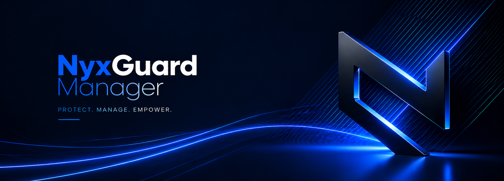

<p align="center">
  
</p>

<h1 align="center">NyxGuard Manager</h1>
<p align="center"><strong>Your applications. Your infrastructure. One security workspace.</strong></p>
<p align="center">A self-hosted reverse proxy with application protection, traffic intelligence,<br />WireGuard access and operational diagnostics.</p>

<p align="center">
  <a href="https://github.com/NyxCloudRO/NyxGuardManager/releases/tag/v5.0.10"></a>
  <a href="https://hub.docker.com/r/nyxmael/nyxguardmanager"></a>
  <a href="LICENSE.md"></a>
</p>
<p align="center">
  <a href="#installation">Install</a> · <a href="#updates-and-recovery">Update</a> · <a href="#vpn-client-and-vpn-agent">VPN</a> · <a href="https://nyxcloud.ro/nyxguard/">Website</a> · <a href="docs/vpn-client.md">Documentation</a> · <a href="https://community.nyxcloud.ro/">Community</a>
</p>

---

<a id="release"></a>

## Overview

Manage HTTPS applications, certificates, access policies, traffic and remote VPN sites from one interface. Configuration, certificates and operational history stay on your infrastructure.

**Current release · 5.0.10** uses a conventional host-managed Docker update: replace application code, reuse persistent storage, run versioned migrations, and verify readiness. MariaDB and its volume remain intact on successful upgrades. Manager uses **VPN Agent 5.0.1** and **schema 45**.

[Read the release notes](https://github.com/NyxCloudRO/NyxGuardManager/releases/tag/v5.0.10) · [Browse the changelog](CHANGELOG.md)

<a id="quick-install"></a>

## Installation

On a fresh supported Ubuntu or Debian host with systemd and `curl` available:

As **root**, including minimal Debian without sudo:

```bash
curl -fsSL https://raw.githubusercontent.com/NyxCloudRO/NyxGuardManager/main/install.sh | bash
```

As an ordinary user with **sudo privileges**:

```bash
curl -fsSL https://raw.githubusercontent.com/NyxCloudRO/NyxGuardManager/main/install.sh | sudo bash
```

The installer checks privileges and prepares Docker/Compose dependencies, persistent storage and automatic startup. If `curl` or certificate trust is missing, follow the [prerequisites and manual installation guide](docs/installation.md#prerequisites-and-manual-installation). Existing installations use the updater.

Open **`https://<your-host>:8443`** and complete the setup wizard. The initial self-signed certificate requires browser confirmation. The installer prepares Docker/Compose, persistent storage and automatic startup. Review the requirements below, especially TUN access if you need VPN.

For existing installations, use the [supported update procedure](#updates-and-recovery).

<a id="capabilities"></a>

## Main features

| Workspace | What it provides |
| --- | --- |
| Reverse proxy | HTTP/HTTPS Proxy Hosts, custom locations, Nginx configuration, access lists, users/roles, Let's Encrypt HTTP/DNS certificates and renewal |
| Security | Per-host WAF, Bot Defence, DDoS Shield, SQL Shield and Auth Bypass; GlobalGate master controls; versioned Web Controls with activation/rollback; custom WAF rules |
| Visibility | Live traffic and RX/TX, complete-window historical analytics, Threat Activity, IPs & Locations, GeoIP, administrative audit history and Event Center |
| Traffic policies | IP/CIDR and country allow/deny rules with expiration; verified crawler allowances require fresh verification after expiry |
| Remote access | Multi-site WireGuard profiles, independent interfaces/routes, handshakes, counters, ping checks, automatic reconnect and overlap protection |
| Operations | Setup wizard, notifications (webhook/Slack/email), token-protected Prometheus metrics, SSO/OIDC mapping, LAN access with ARP discovery, backups and host-managed updates |
| Professional Support | License status, installation health, bounded host checks, guided troubleshooting and redacted support bundles with Support ID upload/readback |

Professional Support is optional. Signed entitlements are verified locally and stored in an encrypted persistent vault. Licensing failure does not disable core proxy management or security controls. Support bundles select structured fields and redact sensitive values; they are not raw configuration/log archives.

## Requirements

<table>
  <thead>
    <tr>
      <th width="25%" align="center">Resource</th>
      <th width="25%" align="center">Minimum</th>
      <th width="25%" align="center">Recommended</th>
      <th width="25%" align="center">High Traffic</th>
    </tr>
  </thead>
  <tbody>
    <tr>
      <td width="240" align="center">CPU</td>
      <td width="240" align="center">1 vCPU</td>
      <td width="240" align="center">2 vCPU</td>
      <td width="240" align="center">4+ vCPU</td>
    </tr>
    <tr>
      <td width="240" align="center">RAM</td>
      <td width="240" align="center">2 GB</td>
      <td width="240" align="center">4 GB</td>
      <td width="240" align="center">8+ GB</td>
    </tr>
    <tr>
      <td width="240" align="center">Storage</td>
      <td width="240" align="center">10 GB SSD</td>
      <td width="240" align="center">20 GB SSD</td>
      <td width="240" align="center">40+ GB SSD</td>
    </tr>
  </tbody>
</table>

Actual resource requirements depend on the number of protected applications (Proxy Hosts), traffic volume, enabled WAF and VPN features, and the configured log retention period (in months). Longer retention periods and higher traffic volumes may require additional CPU, RAM, and disk space.

These tiers are sizing targets, not validated capacity guarantees. Storage covers normal operation; allow additional free space for backups, database growth and upgrades, as well as space for the host OS and Docker image cache. Before an upgrade, the updater requires free space on the backup filesystem of at least three times the current persistent-data size plus 2 GiB. Retained backups and larger image downloads may require more.

Network: host access to Docker registries and certificate services; inbound TCP 80/443 for public applications; administration on HTTPS 8443.

## Supported operating systems

| Operating system | Official support | Historical validation | 5.0.10 OS retesting |
| --- | --- | --- | --- |
| Ubuntu 22.x | Supported | Working installs recorded in 3.0.0 | No new OS-specific validation claimed |
| Ubuntu 24.x | Supported | Working installs recorded in 3.0.0; 5.0.7 runtime install with existing packages | No new OS-specific validation claimed |
| Ubuntu 25.x | Supported | Advertised as tested in the historical README; detailed acceptance not recovered | No new OS-specific validation claimed |
| Ubuntu 26.04 LTS | Supported | 26.04.1 runtime, startup/reboot and VPN accepted in 5.0.4 | No new OS-specific validation claimed |
| Debian 12 | Supported | Working installs recorded in 3.0.0; 5.0.7 privilege/package checks | No new OS-specific validation claimed |
| Debian 13 | Supported | Working installs recorded in 3.0.0 | See the live Debian qualification record |

Support carries forward independently of hotfix retesting. The [installation and compatibility guide](docs/installation.md) records the evidence and configuration limits; [5.0.10 validation coverage](docs/validation-5.0.10.md) describes the focused release tests. Historical family labels do not certify every point release or a fresh-host installation in 5.0.10.

The installer requires Ubuntu or Debian, apt-get and a running systemd host; it prepares Docker/Compose dependencies. VPN also requires usable host TUN and a reachable WireGuard endpoint. Restricted guests without TUN can run Manager and MariaDB without VPN. Other distributions and versions outside this matrix have no established official support; manual Docker deployment is an evaluation path, not a support guarantee.

## Docker deployment

The normal installer deploys Manager and MariaDB, adding the compatible VPN Agent when TUN is usable. Data uses persistent Docker volumes; systemd provides automatic startup. The administration port is HTTPS **8443**, and proxied applications use TCP **80/443**.

HTTP-01 certificates need public inbound TCP 80. DNS challenges need the provider's credentials. Protected Apps are Proxy Hosts with WAF enabled.

<details>
<summary>Manual Docker Compose installation</summary>

For a **fresh installation**, create `/opt/nyxguardmanager`, then save this as `docker-compose.yml`. Manager 5.0.10 uses VPN Agent 5.0.1. Manager readiness comes from its image; do not replace it with an HTTP-only healthcheck.

```yaml
services:
  nyxguard-manager:
    container_name: nyxguard-manager
    image: nyxmael/nyxguardmanager:5.0.10
    restart: unless-stopped
    ports:
      - "80:80"
      - "443:443"
      - "8443:8443"
    environment:
      TZ: "${TZ:-UTC}"
      PUID: "${PUID:-1000}"
      PGID: "${PGID:-1000}"
      DB_MYSQL_HOST: "db"
      DB_MYSQL_PORT: "3306"
      DB_MYSQL_USER: "${DB_MYSQL_USER:-nyxguard}"
      DB_MYSQL_PASSWORD: "${DB_MYSQL_PASSWORD}"
      DB_MYSQL_NAME: "${DB_MYSQL_NAME:-nyxguard}"
      SKIP_CERTBOT_OWNERSHIP: "true"
      NYXCLOUD_LICENSE_VAULT_KEY_PATH: "/run/nyxguard-licensing/vault.key"
      NYXCLOUD_AUTHORITY_URL: "https://licensing.nyxcloud.ro"
      NYXCLOUD_SUPPORT_URL: "https://support-storage.nyxcloud.ro"
      NYXGUARD_VPN_AGENT_URL: "http://127.0.0.1:3198"
      NYXGUARD_VPN_AGENT_TOKEN_PATH: "/run/nyxguard-vpn-auth/token"
      # Persistent access-portal session. Chromium caps persistent cookies at 400 days.
      NYXGUARD_ACCESS_SESSION_TTL_SEC: "34560000"
    # Manager readiness is inherited from the accepted image.
    group_add:
      - "${DOCKER_SOCK_GID:?Set DOCKER_SOCK_GID to the numeric GID of /var/run/docker.sock}"
    volumes:
      - nyxguard_data:/data
      - nyxguard_letsencrypt:/etc/letsencrypt
      - /var/run/docker.sock:/var/run/docker.sock:ro
      - /etc/localtime:/etc/localtime:ro
      - /proc/1/net/arp:/host/proc/net/arp:ro
      - nyxguard_vpn_auth:/run/nyxguard-vpn-auth:ro
      - /var/lib/nyxguard-licensing/vault.key:/run/nyxguard-licensing/vault.key:ro
    depends_on:
      - db

  vpn-client-agent:
    container_name: nyxguard-vpn-agent
    image: nyxmael/nyxguardmanager-vpn-agent:5.0.1
    restart: unless-stopped
    network_mode: "service:nyxguard-manager"
    cap_add:
      - NET_ADMIN
    devices:
      - /dev/net/tun:/dev/net/tun
    environment:
      NYXGUARD_BACKEND_UID: "${PUID:-1000}"
    volumes:
      - nyxguard_vpn:/var/lib/nyxguard-vpn
      - nyxguard_vpn_auth:/run/nyxguard-vpn-auth
      - /etc/localtime:/etc/localtime:ro
    depends_on:
      nyxguard-manager:
        condition: service_healthy
    healthcheck:
      test: ["CMD", "node", "-e", "const fs=require('fs');fetch('http://127.0.0.1:3198/status',{headers:{'X-NyxGuard-VPN-Token':fs.readFileSync('/run/nyxguard-vpn-auth/token','utf8').trim()}}).then(r=>process.exit(r.ok?0:1)).catch(()=>process.exit(1))"]
      interval: 10s
      timeout: 5s
      retries: 5
      start_period: 10s

  db:
    container_name: nyxguard-db
    image: jc21/mariadb-aria:latest
    restart: unless-stopped
    environment:
      TZ: "${TZ:-UTC}"
      MYSQL_ROOT_PASSWORD: "${MYSQL_ROOT_PASSWORD}"
      MYSQL_DATABASE: "${DB_MYSQL_NAME:-nyxguard}"
      MYSQL_USER: "${DB_MYSQL_USER:-nyxguard}"
      MYSQL_PASSWORD: "${DB_MYSQL_PASSWORD}"
    volumes:
      - nyxguard_db:/var/lib/mysql
      - /etc/localtime:/etc/localtime:ro

volumes:
  nyxguard_data:
    name: nyxguard_data
  nyxguard_letsencrypt:
    name: nyxguard_letsencrypt
  nyxguard_db:
    name: nyxguard_db
  nyxguard_vpn:
    name: nyxguard_vpn
  nyxguard_vpn_auth:
    name: nyxguard_vpn_auth
```

Create `.env` with strong, distinct database passwords:

```dotenv
TZ=UTC
PUID=1000
PGID=1000
DB_MYSQL_USER=nyxguard
DB_MYSQL_NAME=nyxguard
DB_MYSQL_PASSWORD=CHANGE_ME_STRONG_PASSWORD
MYSQL_ROOT_PASSWORD=CHANGE_ME_STRONG_ROOT_PASSWORD
```

As root, prepare socket access and a persistent licensing vault key. Preserve an existing key; never generate a replacement during an update.

```bash
chmod 600 .env
nyx_socket_gid="$(stat -c %g /var/run/docker.sock)"
sed -i "s/^PGID=.*/PGID=${nyx_socket_gid}/" .env
printf 'DOCKER_SOCK_GID=%s\n' "$nyx_socket_gid" >> .env
install -d -m 0700 /var/lib/nyxguard-licensing
sh -c 'test ! -e /var/lib/nyxguard-licensing/vault.key && test ! -L /var/lib/nyxguard-licensing/vault.key && umask 077 && set -C && head -c 32 /dev/urandom > /var/lib/nyxguard-licensing/vault.key'
chown "1000:${nyx_socket_gid}" /var/lib/nyxguard-licensing /var/lib/nyxguard-licensing/vault.key
chmod 0600 /var/lib/nyxguard-licensing/vault.key

docker compose --env-file .env up -d
```

Without TUN, start only `nyxguard-manager db`. Keep both services persistent; the installer configures Manager-only boot startup automatically. For a manual VPN-capable deployment, the included [systemd unit](systemd/nyxguardmanager.service) can be installed with `systemctl daemon-reload` and `systemctl enable --now nyxguardmanager.service`. A Manager-only unit must start only its two services.

Do not change volume names for an existing installation. Preserve any `NYXGUARD_*_VOLUME` overrides. Keep the VPN Agent in the current Manager network namespace; recreating Manager alone can strand it in the old namespace. Use the updater for application replacement. After removing/recreating Manager manually, recreate Agent to attach it to the new namespace; a simple container restart does not recreate that attachment. Verify Agent availability from the VPN Client page, because individual container health flags do not prove their communication.

</details>

<a id="update-in-place"></a>

## Updates and recovery

As root:

```bash
curl -fsSL https://raw.githubusercontent.com/NyxCloudRO/NyxGuardManager/main/update.sh | bash
```

As an ordinary sudo-enabled user:

```bash
curl -fsSL https://raw.githubusercontent.com/NyxCloudRO/NyxGuardManager/main/update.sh | sudo bash
```

The updater identifies the installed and latest stable published versions, asks for confirmation, pauses services to verify a complete recovery backup, downloads official images, and replaces Manager using the existing Compose configuration. It restarts the same MariaDB container and reuses the same named volumes, database credentials, licensing key, certificates and VPN state. An installed Agent is recreated only to attach it to Manager's new network namespace, using the release's compatible official Agent image. No temporary database or replacement application stack is created.

Database migrations run through the application's normal startup. Health, migration completion, durable configuration records and storage identities must pass before success is committed. A failed download simply restarts the unchanged installation. A failure after application replacement restores the verified pre-migration data and previous application. A repeated invocation on the current version makes no changes.

Use the current `main` command above. The immutable original 5.0.10 updater asset/tag snapshot predates the terminal-confirmation correction; it is not the current normal updater. [Release notes](https://github.com/NyxCloudRO/NyxGuardManager/releases/tag/v5.0.10) record this distinction.

See [installation and update architecture](docs/application-lifecycle.md) for the persistent storage map, maintenance downtime, version pinning, supported topology and backup requirements. Independent backups remain recommended. Advanced restoration and historical 4.x transitions are documented separately in [advanced recovery](docs/advanced-recovery.md). The in-app update action directs administrators to the host command.

## VPN Client and VPN Agent

Import WireGuard profiles in **Settings → VPN Client**. The separate **VPN Agent 5.0.1** manages interfaces and routes in Manager's network namespace. Site controls expose connection state, handshakes, counters and connectivity checks. Keep Manager and Agent together through restarts.

Installation is capability-based: usable read/write TUN enables Agent installation; unavailable TUN leaves Manager and MariaDB operational and clearly reports **VPN Agent pending — TUN unavailable**. The installer attempts safe guest-side device preparation, but it does not configure a hypervisor.

### Proxmox LXC: TUN and VPN Agent

Manager/database can run without TUN; VPN Agent needs usable read/write `/dev/net/tun`. NyxGuard does not configure the Proxmox host automatically.

Follow the [numbered Proxmox LXC/TUN setup and same-version repair guide](docs/proxmox-lxc-vpn.md). It separates **Proxmox host** and **LXC guest** commands, verifies the target CTID/hostname/IP, backs up its configuration, selects a free `devN` slot and uses supported device passthrough. Never overwrite an occupied slot or convert the LXC to privileged. Restart only the selected LXC if required.

After guest TUN is usable, follow [Agent activation](docs/vpn-client.md#host-tun-prerequisite) using the existing Compose service. It preserves Manager/database data and uses compatible **VPN Agent 5.0.1**. The old release-pinned repair helper is historical guidance only. Then check health and **Settings → VPN Client**, a recent handshake and actual permitted-destination connectivity. TUN presence alone does not prove a working VPN.

See the [VPN Client guide](docs/vpn-client.md) for profiles, allowed networks and remote-peer troubleshooting, or the [website walkthrough](https://nyxcloud.ro/nyxguard/vpn-client.html#proxmox-lxc).

<details>
<summary>Optional GeoIP databases</summary>

Country resolution prefers Cloudflare's `CF-IPCountry`, then local MaxMind GeoLite2 Country, then IP2Location Country. Both local providers use `.mmdb` files.

For MaxMind, create an account and license key, download GeoLite2 Country, and upload under **NyxGuard → IPs & Locations → GeoIP DB**. Alternatively save the MaxMind AccountID/LicenseKey there to enable automatic updates. For IP2Location, download a Country `.mmdb` (Lite or paid) and select that provider when uploading.

</details>

## Quick health checks

```bash
curl -kI https://127.0.0.1:8443/
curl -ksS https://127.0.0.1:8443/api/ | jq
docker ps
docker exec nyxguard-manager node /app/internal/readiness-probe.mjs
docker logs --tail=100 nyxguard-manager
docker logs --tail=100 nyxguard-vpn-agent
```

Expect healthy Manager and DB, plus the VPN Agent on TUN-capable hosts. HTTP 200 alone does not prove database readiness, data preservation or working VPN sites. The Settings **VPN Client** tab shows Agent availability, site controls, handshakes, traffic and ping results. Connect controls appear in both the selected site and disconnected site cards; automatic reconnect starts after the first successful connection. Network/tunnel overlaps and local-network collisions are rejected.

## Security

Use strong credentials, limit access to the administration interface and keep independent database and volume backups. Store DNS-provider and other integration secrets securely. The licensing vault key is persistent: preserve it through updates and recovery.

The supported deployment runs application services under the configured PUID/PGID; Manager has Docker socket group access for metrics and diagnostics. Normal upgrades run on the host. Socket access is powerful even with a read-only bind; expose the administration interface only to trusted users. VPN Agent needs its documented NET_ADMIN capability and TUN device. Review [VPN routing and firewall guidance](docs/vpn-client.md) before connecting a profile.

Professional Support is optional and does not disable core proxy or security features when licensing is unavailable. Generated support bundles use structured redaction; review an exported bundle before sharing it.

<a id="support-and-project"></a>

## Documentation and support

Use [GitHub releases](https://github.com/NyxCloudRO/NyxGuardManager/releases), the [community](https://community.nyxcloud.ro/) and [NyxCloud](https://nyxcloud.ro/nyxguard/) for release and operational guidance. Professional Support adds Diagnostics & Support and Support ID workflows. [Support development](https://buymeacoffee.com/nyxmael).

Created by **Vlad-Eusebiu Cardei** to bring security, observability and predictable day-to-day operations into the same local-first proxy workflow. Project links: [NyxCloud](https://nyxcloud.ro/), [BillCore](https://billcore.ro/) and [Community](https://community.nyxcloud.ro/). Contact: Vlad.Cardei@NyxCloud.ro · Vlad.Cardei@Billcore.ro.

## License

NyxGuard Manager is free to use in internal personal and commercial environments under the **NyxGuard Manager Proprietary License (NMPLA)**. Modification, redistribution, resale and third-party hosting are not permitted. Read the full [license](LICENSE.md).

[Changelog](CHANGELOG.md) · [Release source map](release-source/README.md)

## Publication review

Source and release publication follow the [public-source review policy](docs/publication-policy.md), including dependency, version, artifact and privacy checks.
